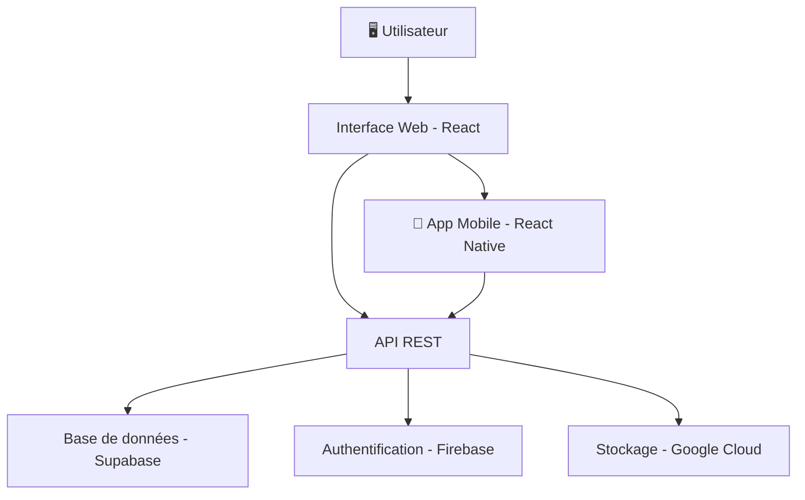

<div style="text-align: center;">
  
</div>

<br/>

**Titre** : TD1 — Markdown  
**Sous-titre** : Atelier informatique  
**Auteur** : Billy Rolph Exumé  
**Date** : Avril 2026  

---

## Table des matières

- [1. À propos](#1-à-propos)
- [2. Stack Technologique](#2-stack-technologique)
- [3. Tableau de compétences](#3-tableau-de-compétences)
- [4. Tâches et exemples de code](#4-tâches-et-exemples-de-code)
- [5. Architecture d'une application web](#5-architecture-dune-application-web)
- [6. Contact](#6-contact)

---

## 1. À propos

🇭🇹 Basé en **Haïti** &nbsp;|&nbsp; 💼 **Full Stack Developer** &nbsp;|&nbsp; 🌍 Disponible pour du **Freelance & Remote**

Je conçois et développe des applications web et mobile modernes, de l'interface utilisateur jusqu'à l'API — propres, scalables et bien structurées.  
*I design and build modern web & mobile apps — clean, scalable, and well-crafted from UI to API.*

---

### Langues parlées

- 🇫🇷 Français
- 🇺🇸 English
- 🇭🇹 Kreyòl Ayisyen

### Disponibilité

- **Freelance** : ouvert
- **Emploi** : ouvert
- **Collaboration** : ouverte
- **Open Source** : ouvert

---

## 2. Stack Technologique

### 🎨 Frontend

[](https://react.dev)
[](https://nextjs.org)
[](https://www.typescriptlang.org)
[](https://tailwindcss.com)
[](https://redux.js.org)

### 📱 Mobile

[](https://reactnative.dev)
[](https://expo.dev)

### ⚙️ Backend & API

[](https://nodejs.org)
[](https://expressjs.com)
[](https://www.postman.com)

### 🗄️ Base de données & Cloud

[](https://firebase.google.com)
[](https://supabase.com)
[](https://cloud.google.com)

### 🔧 Outils

[](https://git-scm.com)
[](https://github.com/Rbil1y)
[](https://figma.com)
[](https://code.visualstudio.com)


---

## 3. Tableau de compétences

| Technologie  | Niveau        | Années d'expérience | Statut           |
|:-------------|:-------------:|:-------------------:|-----------------:|
| React        | Avancé        | 3 ans               | ✅ Maîtrisé      |
| Next.js      | Avancé        | 2 ans               | ✅ Maîtrisé      |
| TypeScript   | Intermédiaire | 2 ans               | 🔄 En cours      |
| React Native | Intermédiaire | 1 an                | 🔄 En cours      |
| Firebase     | Avancé        | 3 ans               | ✅ Maîtrisé      |
| Supabase     | Débutant      | 6 mois              | 📚 Apprentissage |
| Figma        | Intermédiaire | 2 ans               | 🔄 En cours      |
| Google Cloud | Débutant      | 6 mois              | 📚 Apprentissage |

### Citations

> "Any fool can write code that a computer can understand. Good programmers write code that humans can understand."  
> — *Martin Fowler*

> "First, solve the problem. Then, write the code."  
> — *John Johnson*

---

## 4. Tâches et exemples de code

### ✅ Liste de tâches — TD Markdown

- [x] Installer VS Code
- [x] Installer les extensions Markdown
- [x] Créer le fichier `rapport_TD1.md`
- [x] Ajouter titres, listes et séparateurs
- [x] Intégrer des badges et une image
- [x] Créer un tableau avec des données
- [x] Ajouter des citations
- [ ] Convertir le fichier en HTML
- [ ] Convertir le fichier en PDF
- [ ] Convertir le fichier en DOCX
- [ ] Héberger le rapport sur GitHub

### ✅ Liste de tâches — Apprentissage Git & GitHub

- [x] Créer un compte GitHub
- [x] Initialiser un dépôt local avec `git init`
- [x] Faire un premier commit
- [ ] Créer une branche de travail
- [ ] Ouvrir une Pull Request
- [ ] Collaborer sur un projet open source

---

### Exemple de code — Python

```python
# Profil développeur — Billy Rolph Exumé

profil = {
    "nom": "Billy Rolph Exumé",
    "role": "Full Stack Developer",
    "localisation": "Haïti",
    "stack": ["React", "Next.js", "Firebase", "Supabase"],
    "disponible": True
}

def afficher_profil(p):
    print(f"👤 {p['nom']} — {p['role']}")
    print(f"📍 {p['localisation']}")
    print(f"🛠️  Stack : {', '.join(p['stack'])}")
    print(f"✅ Disponible : {'Oui' if p['disponible'] else 'Non'}")

afficher_profil(profil)
```

### Exemple de code — HTML & CSS

```html
<!DOCTYPE html>
<html lang="fr">
<head>
  <meta charset="UTF-8" />
  <title>Billy Rolph Exumé — Portfolio</title>
  <style>
    body {
      font-family: 'Segoe UI', sans-serif;
      background-color: #0D1117;
      color: #C9D1D9;
      display: flex;
      justify-content: center;
      padding: 40px;
    }
    .card {
      background: #161B22;
      border-radius: 12px;
      padding: 24px;
      max-width: 400px;
      text-align: center;
    }
    .card img {
      border-radius: 50%;
      width: 100px;
      height: 100px;
      object-fit: cover;
    }
    .badge {
      display: inline-block;
      background: #6EE7F7;
      color: #0D1117;
      border-radius: 20px;
      padding: 4px 12px;
      font-size: 12px;
      margin: 4px;
    }
  </style>
</head>
<body>
  <div class="card">
    
    <h2>Billy Rolph Exumé</h2>
    <p>Full Stack Developer 🚀</p>
    <span class="badge">React</span>
    <span class="badge">Next.js</span>
    <span class="badge">Firebase</span>
  </div>
</body>
</html>
```

### Syntaxe HTML dans Markdown

<div style="background-color: #0D1117; color: #6EE7F7; padding: 16px; border-radius: 8px; font-family: monospace;">
  <strong>Billy Rolph Exumé</strong> — Full Stack Developer 🚀<br/>
  📍 Haïti &nbsp;|&nbsp; 📧 <a href="mailto:Rbillyexume@gmail.com" style="color: #6EE7F7;">Rbillyexume@gmail.com</a>
</div>

<br/>

<p style="color: #FF6C37; font-weight: bold;">⚡ Disponible pour des missions freelance et des opportunités remote.</p>

---

## 5. Architecture d'une application web



---

## 6. Contact

| 🌐 Portfolio | 📧 Email | 💻 GitHub |
|:---:|:---:|:---:|
| [rbil1y.github.io/portfolio](https://rbil1y.github.io/portfolio/) | [Rbillyexume@gmail.com](mailto:Rbillyexume@gmail.com) | [@Rbil1y](https://github.com/Rbil1y) |

---

> *"Code with purpose. Build with passion. Ship with pride."*

**Billy Rolph Exumé — Full Stack Developer 🚀**